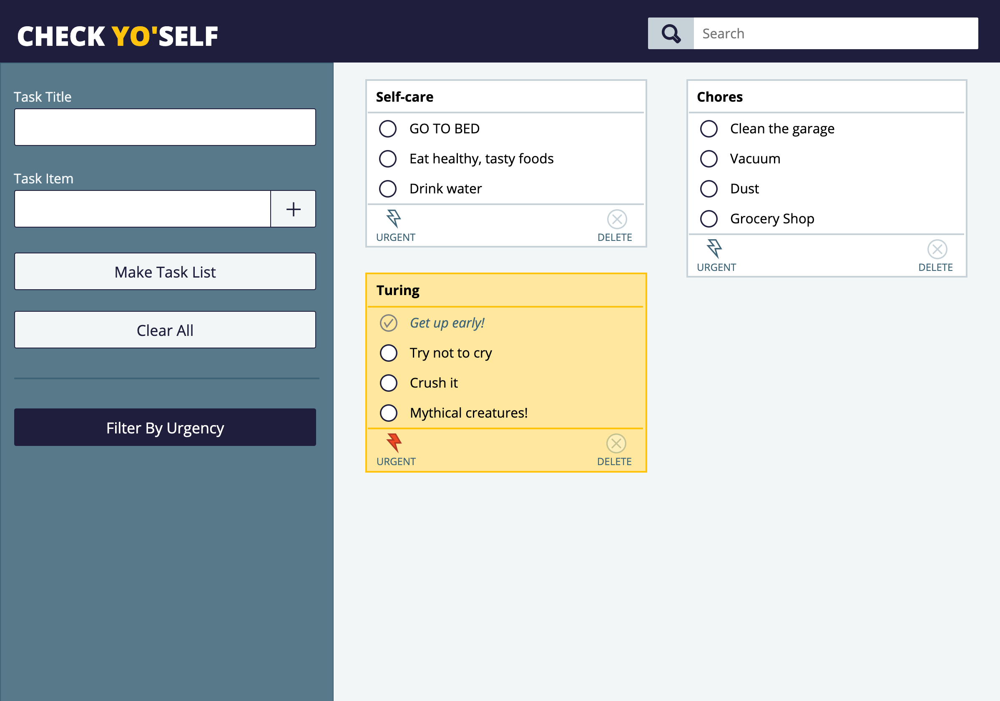
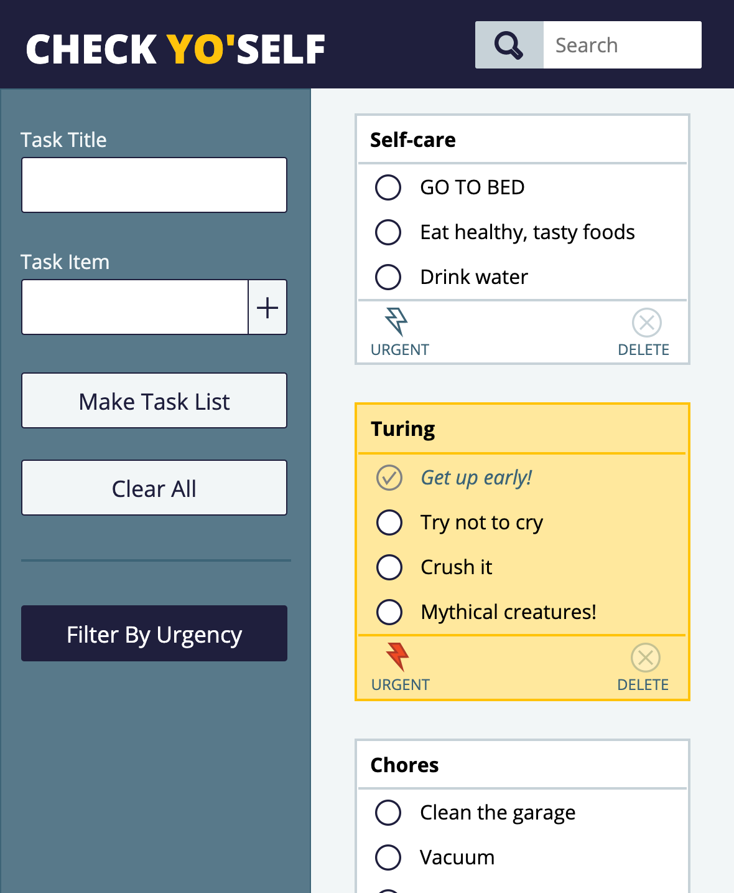
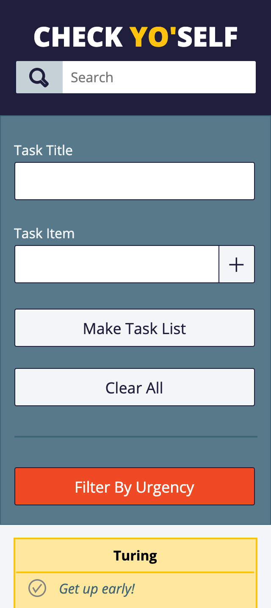

# Check Yo'Self! 

## Summary 

Check Yo'self is the fourth, and final, project of Module One at the Turing School of Software and Design. The learning goals for the project were as follows: 

+ Solidify and demonstrate your use of:

  * semantic HTML
 
  * clean & organized CSS styles
 
  * DRY JavaScript
 
  * localStorage to persist data
 
+ Iterate through/filter dom elements using for loops/array prototype methods
+ Understand the difference between the data model and how the data is displayed on the DOM
+ Ability to match/recreate a UI and create a great UX

This project combines the challenges of setting and getting information in local storage, as well as accessing arrays of objects nested within an array of objects. 

## User-facing Features

Check Yo'self allows the user to create custom lists with titles and inventories of individual checkable tasks by using the input fields on the left side of the page. The lists themselves are displayed in an initially blank section on the right, and populate in a "masonry layout" style—columns of lists with staggered bottom borders (depending on their lengths). Upon completion of each item on the task list, clicking the icon to the left of each line allows the user to mark the task as completed. When the entire list found on the card is completed, a delete button on the lower right corner is enabled, allowing the user to clear the card from the display area. On the lower left corner of each card the user can click an icon to mark that specific list as urgent. Task lists can be searched based on the content of their titles, as well as whether or not they have been marked as urgent.

## Comp Images and Screenshots

### Images from the Comp

### My Images

